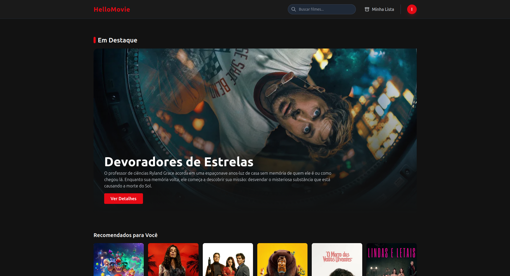
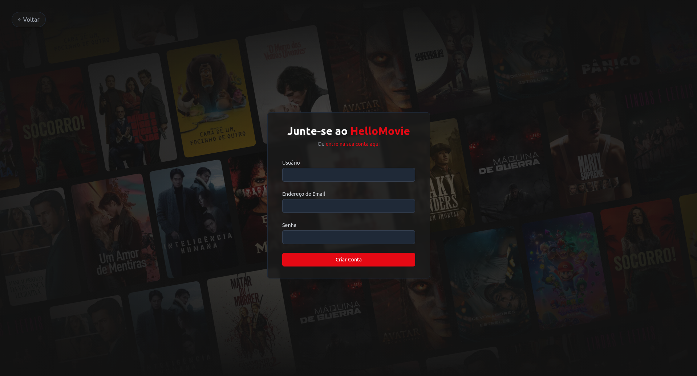
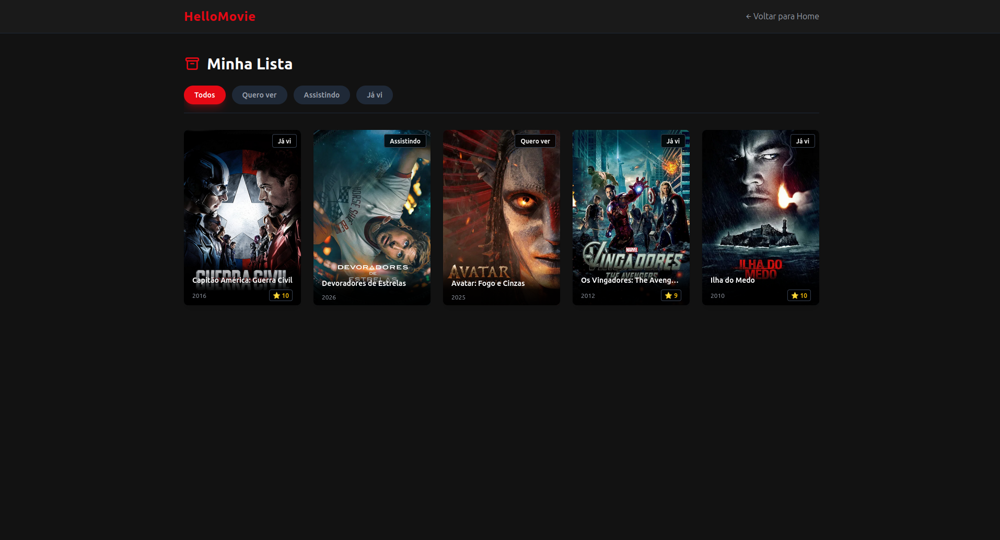
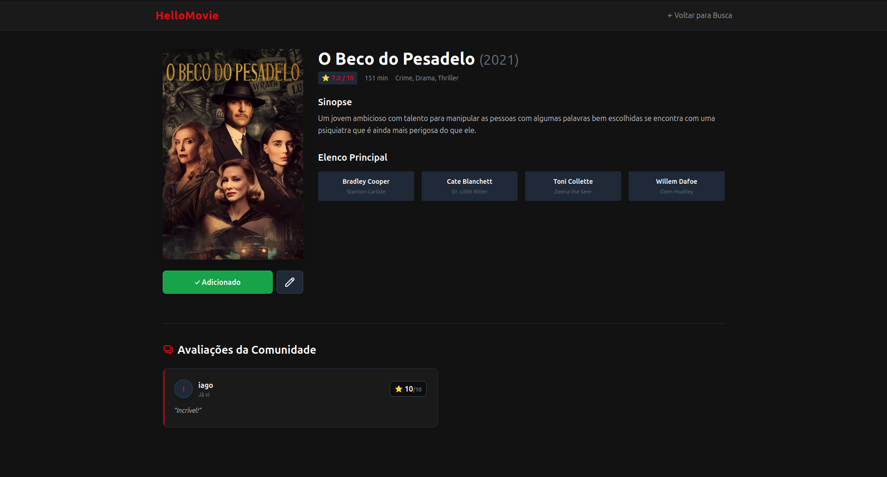

# 🎬 HelloMovie

<div align="center">
  <p><strong>Your Personal Cinematic Diary</strong></p>
  <p>A fullstack web application to search, record, and manage your favorite movies, inspired by platforms like Letterboxd.</p>

  
  
  
  
  
</div>

<br>

> **Note:** This project was developed as part of the *Introduction to Software Systems Development* course at IME-USP.

## ✨ Features

- **Secure Authentication:** Account creation and login using password encryption (Bcrypt) and session control via Cookies.
- **TMDb Integration:** Real-time movie search, fetching posters, synopses, cast, and current trends directly from The Movie Database API.
- **Personal Catalog (Full CRUD via HTMX):**
  - **Add:** Save movies to your personal list.
  - **Read:** View your saved movies with dynamic filters (Watched, Want to Watch, Watching, Favorite).
  - **Update:** Edit status, rate from 1 to 10, and write a personal review.
  - **Delete:** Remove movies from your list interactively and securely.
- **Community (Social Network):** Share your opinions! Each movie's detail page displays ratings, scores, and comments made by other platform users.
- **Responsive Interface:** Modern design built with Tailwind CSS, fully adaptable for mobile devices and desktops.
- **Single Page Application (SPA) Feel:** Thanks to HTMX, database interactions and UI updates (like the registration modal) happen seamlessly without needing to reload the entire page with each click.

## 📸 Screenshots

<div align="center">
  
  
</div>
<div align="center">
  
  
</div>

## 🛠️ Technologies Used

**Backend:**
- [FastAPI](https://fastapi.tiangolo.com/) - High-performance web framework.
- [SQLModel](https://sqlmodel.tiangolo.com/) - ORM for SQLite database interaction.
- [Passlib & Bcrypt](https://passlib.readthedocs.io/) - Password hashing.

**Frontend:**
- [Jinja2](https://jinja.palletsprojects.com/) - HTML templating engine.
- [HTMX](https://htmx.org/) - AJAX interactions directly in HTML (hx-get, hx-post, hx-put, hx-delete).
- [Tailwind CSS](https://tailwindcss.com/) - Utility-first styling.

## 🚀 How to Run the Project Locally

### 1. Prerequisites
Make sure you have Python 3.10+ installed on your machine. You will also need a Read Access Token API key from [TMDb](https://developer.themoviedb.org/docs/getting-started).

### 2. Clone the Repository
```bash
git clone [https://github.com/YOUR_USERNAME/hellomovie.git]
cd hellomovie
```

### 3. Create and Activate the Virtual Environment
```bash
# On Windows:
python -m venv .venv
.venv\Scripts\activate

# On Linux/Mac:
python3 -m venv .venv
source .venv/bin/activate
```

### 4. Install Dependencies
```bash
pip install -r requirements.txt
```

### 5. Configure Environment Variables
Create a file named `.env` in the project root and add your TMDb token:
```env
TMDB_READ_TOKEN=your_big_token_provided_by_tmdb_here
```

### 6. Start the Server
Run the command below to start Uvicorn:
```bash
uvicorn src.main:app --reload
```
The application will be available at `http://127.0.0.1:8000`. 
*(The SQLite database will be created automatically on first access).*
